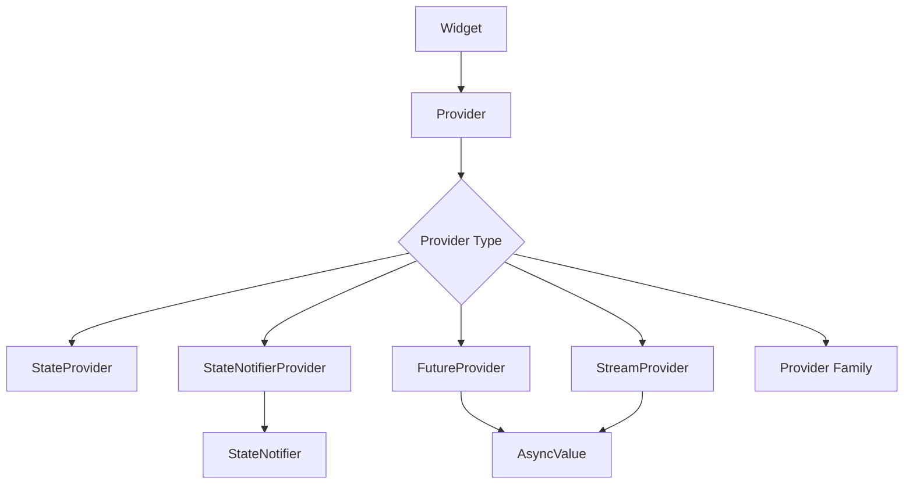
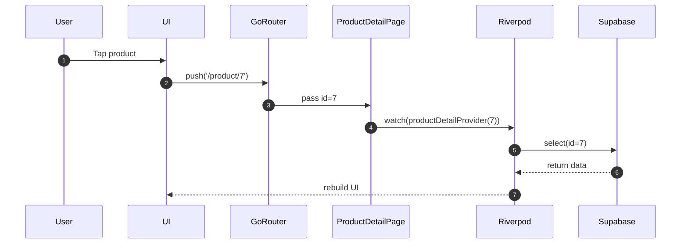

# 📘 Riverpod Complete Guide  
รองรับ **Markdown Preview + Mermaid Diagram**

---

## 🧭 ภาพรวมระบบ Riverpod (Mermaid Diagram)



---

## 🚀 1. Provider Types ที่ต้องรู้

### ✔ Provider  
ค่าสำเร็จรูป ไม่เปลี่ยน  
```dart
final appNameProvider = Provider((ref) => "SkyLogic App");
```

---

### ✔ StateProvider  
ค่าที่แก้ไขง่าย เช่น int/bool  
```dart
final counterProvider = StateProvider((ref) => 0);
```

---

### ✔ StateNotifierProvider (สำคัญสุด)
เหมาะกับ CRUD / List / Object / Business Logic  
```dart
class TodoNotifier extends StateNotifier<List<String>> {
  TodoNotifier() : super([]);

  void add(String item) => state = [...state, item];
}

final todoProvider =
    StateNotifierProvider<TodoNotifier, List<String>>(
  (ref) => TodoNotifier(),
);
```

---

### ✔ FutureProvider  
โหลดข้อมูลครั้งเดียว  
```dart
final productsProvider = FutureProvider((ref) async {
  return supabase.from('products').select();
});
```

---

### ✔ StreamProvider  
ข้อมูล Real-time  
```dart
final productStreamProvider = StreamProvider((ref) {
  return supabase.from('products').stream(primaryKey: ['id']);
});
```

---

### ✔ Provider Family (หัวใจของ Detail Page)
```dart
final productByIdProvider = FutureProvider.family((ref, int id) async {
  return supabase.from('products').select().eq('id', id).single();
});
```

ใช้:
```dart
ref.watch(productByIdProvider(5));
```

---

## 🧩 2. ref.watch / ref.read / ref.listen

### ✔ watch — UI rebuild อัตโนมัติ  
```dart
final count = ref.watch(counterProvider);
```

### ✔ read — ดึงค่าแบบไม่ rebuild  
```dart
ref.read(counterProvider.notifier).state++;
```

### ✔ listen — ฟัง state เปลี่ยน แล้วแจ้งเตือน UI  
```dart
ref.listen(counterProvider, (prev, next) {
  print("changed → $next");
});
```

---

## 🧠 3. AsyncValue (ต้องรู้ 100%)

ใช้กับ Future / Stream เสมอ

```dart
final asyncProducts = ref.watch(productsProvider);

asyncProducts.when(
  data: (items) => ListView(...),
  loading: () => CircularProgressIndicator(),
  error: (e, st) => Text("Error: $e"),
);
```

---

## 🛠 4. โครงสร้าง Riverpod แบบ Clean

```plaintext
lib/
 ├─ models/
 ├─ providers/
 │   ├─ product_provider.dart
 │   └─ auth_provider.dart
 ├─ repository/
 ├─ screens/
 └─ main.dart
```

---

## 📦 5. ตัวอย่าง Product Provider + CRUD

```dart
class ProductNotifier extends StateNotifier<List<Product>> {
  ProductNotifier(): super([]);

  void add(Product p) => state = [...state, p];

  void update(Product p) =>
      state = [for (final x in state) if (x.id == p.id) p else x];

  void delete(String id) =>
      state = state.where((p) => p.id != id).toList();
}

final productProvider =
    StateNotifierProvider<ProductNotifier, List<Product>>(
  (ref) => ProductNotifier(),
);
```

---

## 🔍 6. Product Detail ด้วย Provider Family + Supabase

```dart
final productDetailProvider =
    FutureProvider.family((ref, String id) async {
  final supabase = Supabase.instance.client;
  return supabase
      .from('products')
      .select()
      .eq('id', id)
      .single();
});
```

---

## 🧭 7. GoRouter + Provider Family (Mermaid)




---

## 🧱 8. Cheat Sheet แบบ 1 หน้า

### การเลือก Provider:
| ต้องการ | ใช้ |
|--------|------|
| ค่าคงที่ | Provider |
| ค่าที่เปลี่ยนง่าย | StateProvider |
| CRUD / List / Object | StateNotifierProvider |
| Future API | FutureProvider |
| Realtime | StreamProvider |
| ใช้ ID โหลดข้อมูล | Provider Family |

---

## 🧨 จบคู่มือ  
ไฟล์นี้ใช้งานได้บน VS Code, Obsidian, GitHub พร้อม diagrams Mermaid

::: mermaid
graph TD;
    A-->B;
    A-->C;
    B-->D;
    C-->D;
:::